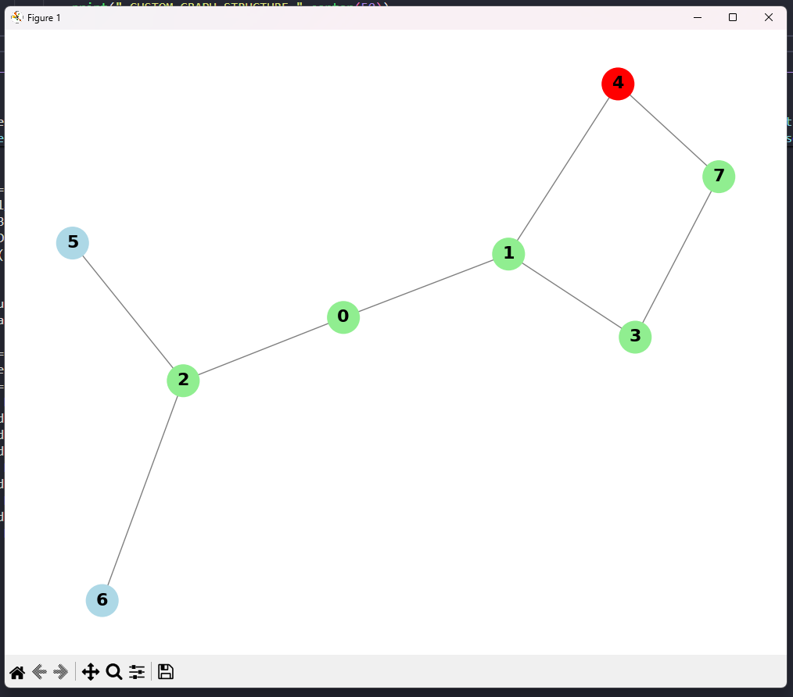

# Graph Algorithm Visualizer

A simple Python-based visualizer for BFS (Breadth-First Search) and DFS (Depth-First Search) algorithms.

## Screenshots

### Terminal Interface


### Graph Visualization


## Features

- Visual representation of graph traversal
-  Color-coded nodes (red = current, green = visited, blue = unvisited)
-  Step-by-step traversal output
-  Easy to use and understand
-  Pre-built sample graph for instant demonstration

## Requirements

Install the required packages:

```bash
pip install matplotlib networkx
```

## How to Run

```bash
python graph_visualizer.py
```

## Usage

1. **Program starts with a sample graph automatically loaded**

2. **Select Algorithm:**
   - BFS (Breadth-First Search)
   - DFS (Depth-First Search)
   - Both algorithms

3. **Enter starting node** (default sample graph has nodes 0-7)

4. **Watch the Visualization:**
   - 🔴Red nodes show the current node being explored
   - 🟢Green nodes show already visited nodes
   - 🔵Blue nodes show unvisited nodes

## How It Works

### BFS (Breadth-First Search)
- Explores nodes level by level
- Uses a queue (FIFO - First In First Out)
- Good for finding shortest paths

### DFS (Depth-First Search)
- Explores as deep as possible before backtracking
- Uses recursion (stack-based)
- Good for exploring all paths

## Sample Graph Structure

```
    0
   / \
  1   2
 / \ / \
3  4 5  6
 \ /
  7
```

Available nodes: 0, 1, 2, 3, 4, 5, 6, 7

## Project Structure

```
algorithm visualiser/
├── graph_visualizer.py  # Main program
├── README.md           # Documentation
├── GUIDE.md           # Usage examples
├── requirements.txt    # Python dependencies
└── screenshots/       # Project screenshots
    ├── terminal ui.png
    └── graph_visualiser.png
```


